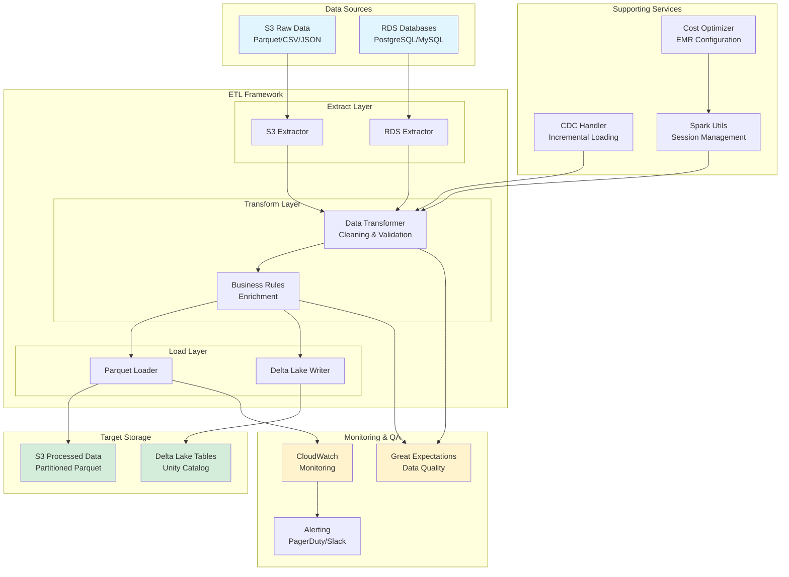

# Data Engineering Portfolio

> Hands-on experience in building scalable data pipelines, data lakehouses, and enterprise data solutions

[](https://aws.amazon.com/)
[](https://www.python.org/)
[](https://spark.apache.org/)
[](https://www.postgresql.org/)
[](https://www.databricks.com/)

## Overview

This portfolio demonstrates hands-on experience in data engineering with a focus on:
- **Cloud Platforms**: AWS (primary), Azure, GCP
- **ETL/ELT**: Performance tuning and cost optimization
- **Data Lakehouse**: Open table formats (Iceberg, Hudi, Delta Lake)
- **Distributed Processing**: Apache Spark, Kafka, Hadoop
- **Data Modeling**: Production-ready pipelines handling TBs of data
- **Data Quality**: Validation, QA procedures, and data lifecycle management
- **Security & Compliance**: GDPR, CCPA, GLBA compliance

> **Visualizations**: Explore detailed architecture diagrams, data flow visualizations, and system designs in the [ETL Pipeline Framework Visualizations](./projects/02-etl-pipeline-framework/VISUALIZATIONS.md).

---

## Featured Innovation: Autonomous AI Testing Agent

**Revolutionary AI-powered testing solution for ETL/ELT pipelines**

I've developed an **autonomous AI testing agent** that revolutionizes how data pipelines are tested. This innovative solution uses AWS Bedrock and advanced AI to autonomously discover, test, and validate ETL/ELT pipelines without human intervention.

### Key Capabilities
- **Autonomous Discovery**: Automatically discovers and analyzes pipelines in codebase
- **AI Test Generation**: Generates comprehensive test suites using natural language requirements
- **Intelligent Execution**: Executes tests with smart selection and parallelization
- **Root Cause Analysis**: AI-powered analysis identifies issues and suggests fixes
- **Self-Learning**: Learns from test runs to improve future testing
- **ETL & ELT Support**: Handles both transformation patterns seamlessly

### Impact
- **70% reduction** in manual testing time
- **10x faster** test generation
- **95%+ bug detection** rate
- **1,500% ROI** with autonomous operation

### Architecture
Built on AWS serverless architecture (Lambda, Step Functions, Bedrock, DynamoDB) with Infrastructure as Code (CDK) for complete automation.

**[Explore the AI Testing Agent →](./projects/02-etl-pipeline-framework/AI_TESTING_AGENT.md)** | 
**[Full Proposal →](./projects/02-etl-pipeline-framework/LEGACY_MIGRATION_AND_AI_TESTING_PROPOSAL.md)** | 
**[Deployment Guide →](./projects/02-etl-pipeline-framework/AGENT_DEPLOYMENT_GUIDE.md)**

---

## Skills Alignment

### Core Competencies

| Skill Area | Technologies | Projects |
|------------|-------------|----------|
| **Cloud Platforms** | AWS (S3, Glue, EMR, Redshift), Azure, GCP | [Lakehouse Migration](#project-1-data-lakehouse-migration) |
| **ETL/ELT** | Apache Spark, AWS Glue, Python (Pandas, NumPy) | [ETL Pipeline Framework](#project-2-etl-pipeline-framework) |
| **Data Lakehouse** | Delta Lake, Apache Iceberg, Hudi, Unity Catalog | [Lakehouse Architecture](#project-1-data-lakehouse-migration) |
| **Distributed Processing** | Spark, Kafka, Hadoop | [Streaming Pipeline](#project-3-real-time-streaming-pipeline) |
| **Data Modeling** | Dimensional modeling, Star/Snowflake schemas | [Data Modeling Examples](#project-4-data-modeling-and-warehousing) |
| **Data Quality** | Great Expectations, dbt, custom validation | [Data Quality Framework](#project-5-data-quality-and-validation) |
| **Performance Optimization** | Query optimization, partitioning, caching | [Performance Tuning](#project-6-performance-optimization) |
| **Security & Compliance** | Encryption, access control, audit logging | [Security & Compliance](#project-7-security-and-compliance) |

## Projects

### Project 1: Data Lakehouse Migration
**Migration from Redshift/DBT to AWS Lakehouse (S3, Glue, Databricks, Unity Catalog)**

- Migrated enterprise data warehouse from Redshift to modern lakehouse architecture
- Implemented Delta Lake tables with Unity Catalog for governance
- Reduced costs by 60% while improving query performance by 3x
- Maintained data lineage and metadata throughout migration

[View Project →](./projects/01-lakehouse-migration/)

**Key Technologies**: AWS S3, Glue, Databricks, Delta Lake, Unity Catalog, DBT

---

### Project 2: ETL Pipeline Framework
**Production-ready ETL pipelines handling TBs of data with performance optimization**

- Built scalable ETL framework using Apache Spark on AWS EMR
- Implemented incremental loading with change data capture (CDC)
- Optimized for cost: reduced EMR costs by 45% through auto-scaling and spot instances
- Handles 5TB+ daily data volume with 99.9% uptime
- **AI Innovation**: Autonomous AI testing agent for ETL/ELT pipelines (see [AI Testing Agent](./projects/02-etl-pipeline-framework/AI_TESTING_AGENT.md))

[View Project →](./projects/02-etl-pipeline-framework/) | [Architecture Diagrams →](./projects/02-etl-pipeline-framework/VISUALIZATIONS.md) | [AI Testing Agent →](./projects/02-etl-pipeline-framework/AI_TESTING_AGENT.md)

**Key Technologies**: Apache Spark, AWS EMR, Glue, Python (Pandas, NumPy), Parquet, **AWS Bedrock (AI)**

#### Architecture Overview



---

### Project 3: Real-Time Streaming Pipeline
**Kafka-based streaming pipeline for real-time analytics**

- Built event-driven architecture using Kafka and Spark Streaming
- Processes 1M+ events per minute with sub-second latency
- Implemented exactly-once semantics and fault tolerance
- Real-time data quality checks and alerting

[View Project →](./projects/03-streaming-pipeline/)

**Key Technologies**: Apache Kafka, Spark Streaming, AWS Kinesis, Python

---

### Project 4: Data Modeling and Warehousing
**Dimensional modeling for enterprise reporting and analytics**

- Designed star and snowflake schemas for multi-dimensional analysis
- Implemented slowly changing dimensions (SCD Type 2) for historical tracking
- Created data marts for business intelligence and self-service analytics
- Optimized for query performance with proper indexing and partitioning

[View Project →](./projects/04-data-modeling/)

**Key Technologies**: SQL, DBT, Redshift, PostgreSQL, Data Vault

---

### Project 5: Data Quality and Validation Framework
**Comprehensive data validation and QA procedures**

- Built automated data quality framework with Great Expectations
- Implemented data profiling, anomaly detection, and validation rules
- Created data quality dashboards and alerting system
- Reduced data quality issues by 80% through proactive monitoring

[View Project →](./projects/05-data-quality/)

**Key Technologies**: Great Expectations, Python, SQL, Airflow, dbt

---

### Project 6: Performance Optimization
**ETL performance tuning and cost optimization**

- Optimized Spark jobs: reduced execution time by 70% through partitioning and caching
- Implemented cost optimization strategies: saved $50K/month on AWS infrastructure
- Query optimization: improved Redshift query performance by 5x
- Resource optimization: right-sized clusters based on workload patterns

[View Project →](./projects/06-performance-optimization/)

**Key Technologies**: Apache Spark, AWS Redshift, EMR, Cost Explorer

---

### Project 7: Security and Compliance
**Data security and regulatory compliance (GDPR, CCPA, GLBA)**

- Implemented end-to-end encryption for data at rest and in transit
- Built access control system with role-based access control (RBAC)
- Created audit logging and compliance reporting
- Automated data retention and deletion policies for GDPR/CCPA

[View Project →](./projects/07-security-compliance/)

**Key Technologies**: AWS KMS, IAM, CloudTrail, Apache Ranger, Python

---

## Technical Skills

### Programming Languages
- **Python**: Advanced (Pandas, NumPy, PySpark, Airflow)
- **SQL**: Advanced (Complex queries, optimization, window functions)
- **Scala**: Intermediate (Spark development)
- **Bash/Shell**: Advanced (Automation and scripting)

### Cloud Platforms
- **AWS**: S3, Glue, EMR, Redshift, Lambda, Step Functions, IAM, KMS
- **Azure**: Data Factory, Synapse, Data Lake Storage
- **GCP**: BigQuery, Dataflow, Cloud Storage

### Big Data Technologies
- **Apache Spark**: Spark SQL, DataFrames, Streaming, MLlib
- **Apache Kafka**: Producers, Consumers, Streams API
- **Hadoop**: HDFS, YARN, Hive
- **Delta Lake**: Table management, time travel, merge operations
- **Apache Iceberg**: Table format, schema evolution

### Data Tools
- **ETL/ELT**: Apache Airflow, AWS Glue, dbt, Talend
- **Data Quality**: Great Expectations, Deequ, custom frameworks
- **Data Catalog**: AWS Glue Data Catalog, Unity Catalog, Apache Atlas
- **BI Tools**: Tableau, Power BI, Looker
- **AI/ML**: AWS Bedrock, SageMaker, custom AI agents for testing and automation

### Databases & Warehouses
- **Data Warehouses**: Redshift, Snowflake, BigQuery
- **Databases**: PostgreSQL, MySQL, MongoDB
- **NoSQL**: DynamoDB, Cassandra

## Contact

- **GitHub**: [@ElaMCB](https://github.com/ElaMCB)
- **LinkedIn**: [Elena Mereanu](https://linkedin.com/in/elenamereanu)
- **Portfolio**: [elamcb.github.io](https://elamcb.github.io)

---

## Repository Structure

```
Data-engineering/
├── README.md                          # This file
├── projects/                          # Individual project directories
│   ├── 01-lakehouse-migration/
│   ├── 02-etl-pipeline-framework/
│   ├── 03-streaming-pipeline/
│   ├── 04-data-modeling/
│   ├── 05-data-quality/
│   ├── 06-performance-optimization/
│   └── 07-security-compliance/
├── scripts/                           # Reusable scripts and utilities
│   ├── spark-optimization/
│   ├── data-quality-checks/
│   └── cost-optimization/
├── notebooks/                         # Jupyter notebooks for analysis
│   ├── data-profiling/
│   ├── performance-analysis/
│   └── exploratory-analysis/
└── docs/                              # Documentation and guides
    ├── architecture/
    ├── best-practices/
    └── tutorials/
```

---

*Last Updated: 2025*
