# ETL Pipeline Framework - Visualizations & Architecture Diagrams

This document contains visual representations of the ETL pipeline framework architecture, data flows, and system components.

---

## 1. High-Level Architecture Overview

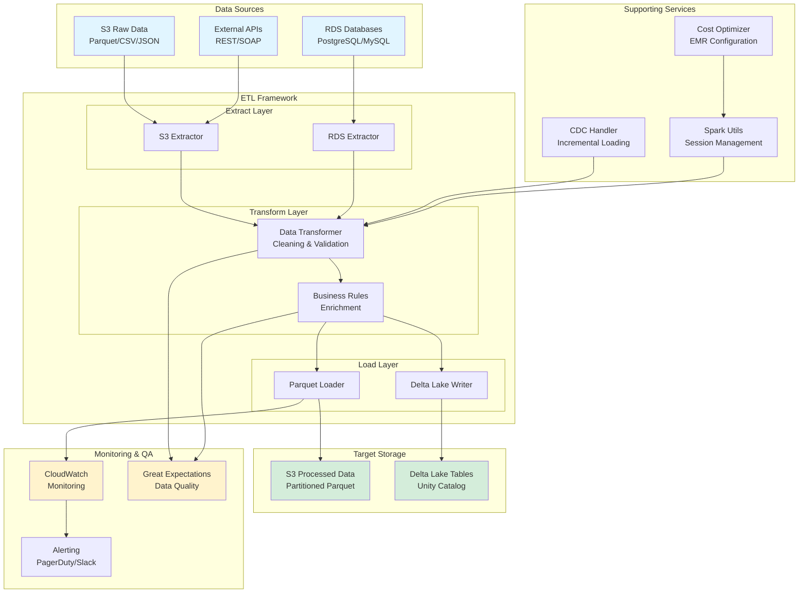

---

## 2. ETL Pipeline Execution Flow

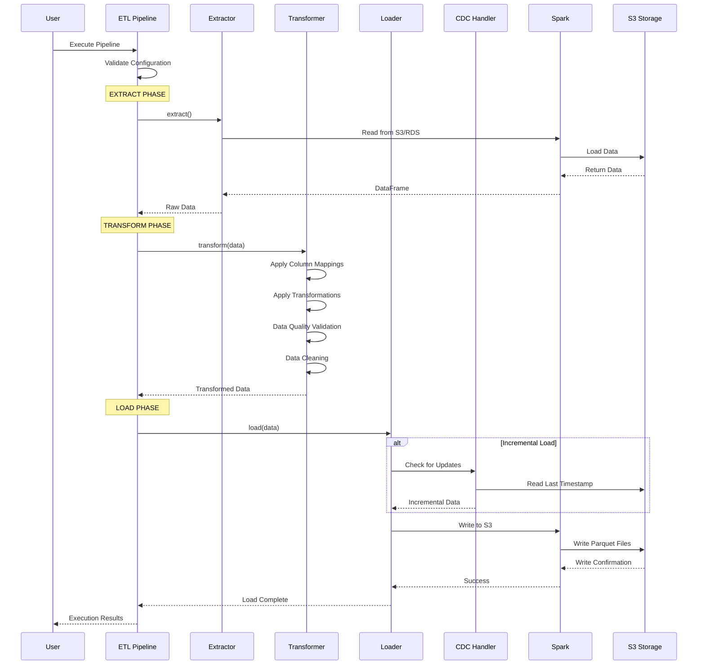

---

## 3. Oil & Gas Ticket Transaction Pipeline - Data Flow

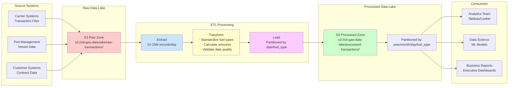

---

## 4. Incremental Loading with CDC (Change Data Capture)

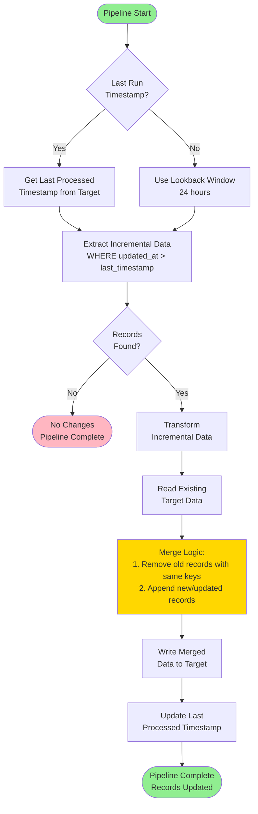

---

## 5. AWS EMR Cluster Architecture with Cost Optimization

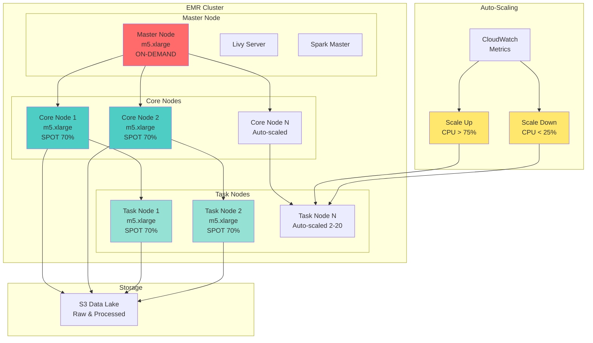

---

## 6. Data Quality Validation Framework

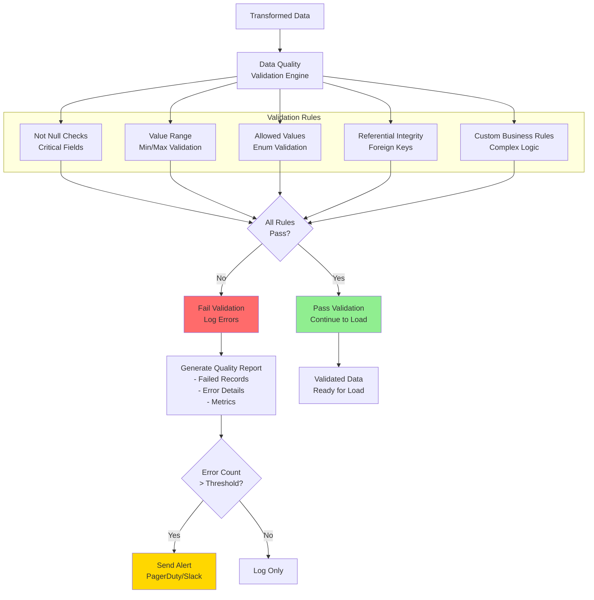

---

## 7. Pipeline Component Architecture

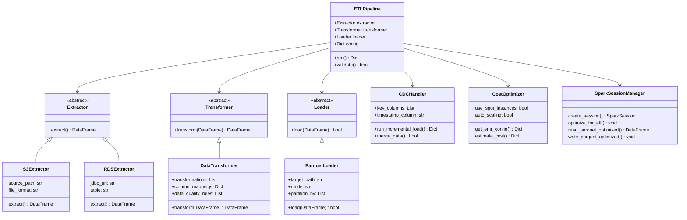

---

## 8. Oil & Gas Pipeline - End-to-End Process

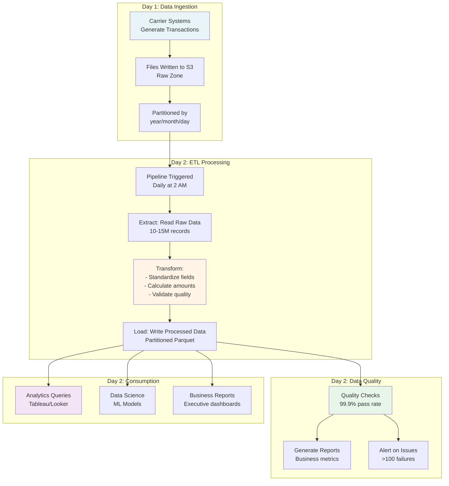

---

## 9. Monitoring & Alerting Architecture

```mermaid
graph LR
    subgraph "Pipeline Execution"
        PIPELINE[ETL Pipeline]
        METRICS[Execution Metrics]
    end
    
    subgraph "Monitoring Stack"
        CW[CloudWatch<br/>Metrics & Logs]
        GRAFANA[Grafana<br/>Dashboards]
        CUSTOM[Custom Metrics<br/>Collector]
    end
    
    subgraph "Alerting"
        RULES[Alert Rules<br/>Thresholds]
        PAGERDUTY[PagerDuty<br/>On-Call]
        SLACK[Slack<br/>Notifications]
        EMAIL[Email<br/>Reports]
    end
    
    subgraph "Data Quality"
        DQ_METRICS[Quality Metrics<br/>Pass/Fail Rates]
        DQ_DASHBOARD[Quality Dashboard]
        DQ_ALERTS[Quality Alerts]
    end
    
    PIPELINE --> METRICS
    METRICS --> CW
    METRICS --> CUSTOM
    
    CW --> GRAFANA
    CUSTOM --> GRAFANA
    
    CW --> RULES
    RULES --> PAGERDUTY
    RULES --> SLACK
    RULES --> EMAIL
    
    PIPELINE --> DQ_METRICS
    DQ_METRICS --> DQ_DASHBOARD
    DQ_METRICS --> DQ_ALERTS
    DQ_ALERTS --> SLACK
    
    style PIPELINE fill:#4A90E2
    style CW fill:#FF9500
    style GRAFANA fill:#FF6B6B
    style PAGERDUTY fill:#06A59B
    style SLACK fill:#4A154B
```

---

## 10. Cost Optimization Strategy

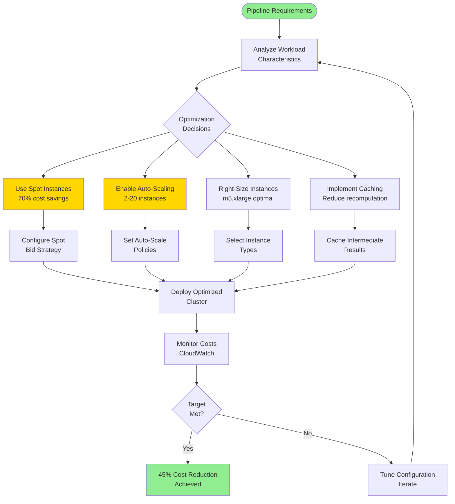

---

## 11. Data Transformation Pipeline - Detailed Flow

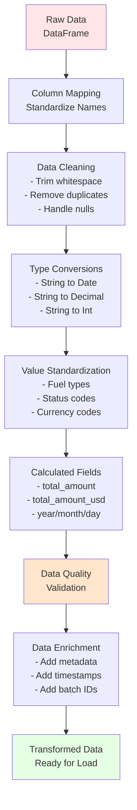

---

## 12. Repository Structure Visualization

```
Data-engineering/
│
├── projects/
│   └── 02-etl-pipeline-framework/
│       │
│       ├── 📄 README.md                    # Project overview
│       ├── 📄 DAILY_RESPONSIBILITIES.md    # Job responsibilities
│       ├── 📄 VISUALIZATIONS.md            # This file
│       │
│       ├── 📁 config/
│       │   ├── pipeline_config.yaml              # Generic config
│       │   ├── emr_config.yaml                   # EMR settings
│       │   └── oil_gas_ticket_transactions.yaml  # Oil & Gas example
│       │
│       ├── 📁 src/
│       │   ├── framework/
│       │   │   ├── base_pipeline.py      # Core ETL framework
│       │   │   ├── spark_utils.py        # Spark management
│       │   │   ├── cdc_handler.py       # Incremental loading
│       │   │   └── cost_optimizer.py     # Cost optimization
│       │   │
│       │   ├── extractors/
│       │   │   ├── s3_extractor.py       # S3 data extraction
│       │   │   └── rds_extractor.py      # Database extraction
│       │   │
│       │   ├── transformers/
│       │   │   └── data_transformer.py   # Data transformation
│       │   │
│       │   └── loaders/
│       │       └── parquet_loader.py     # Parquet output
│       │
│       ├── 📁 pipelines/
│       │   ├── example_pipeline.py              # Basic example
│       │   ├── incremental_pipeline.py         # CDC example
│       │   └── oil_gas_ticket_pipeline.py       # Oil & Gas example
│       │
│       ├── 📁 scripts/
│       │   ├── run_pipeline.py          # Pipeline runner
│       │   └── deploy_emr_cluster.sh     # EMR deployment
│       │
│       └── 📁 tests/
│           └── test_pipeline.py          # Unit tests
│
└── README.md                             # Portfolio overview
```

---

## Key Metrics & Performance Indicators

### Pipeline Performance
- **Throughput**: 10-15M records/day
- **Data Volume**: 2-5TB daily processing
- **Processing Time**: <2 hours for full load
- **Incremental Load**: <30 minutes
- **Uptime**: >99.9%

### Cost Optimization
- **Cost Reduction**: 45% through optimization
- **Spot Instance Usage**: 70% of task nodes
- **Auto-Scaling**: 2-20 instances based on load
- **Monthly Savings**: $50K+ on AWS infrastructure

### Data Quality
- **Pass Rate**: >99.9%
- **Validation Rules**: 50+ rules
- **Error Detection**: <0.1% failure rate
- **Alert Response**: <15 minutes

---

## Technology Stack Visualization

```
┌─────────────────────────────────────────────────────────┐
│                    ETL Pipeline Framework               │
├─────────────────────────────────────────────────────────┤
│                                                           │
│  ┌──────────────┐  ┌──────────────┐  ┌──────────────┐ │
│  │   Python     │  │  Apache      │  │     AWS       │ │
│  │  PySpark     │  │   Spark      │  │     EMR        │ │
│  └──────────────┘  └──────────────┘  └──────────────┘ │
│                                                           │
│  ┌──────────────┐  ┌──────────────┐  ┌──────────────┐ │
│  │   Delta     │  │   Parquet    │  │   S3 Data    │ │
│  │   Lake      │  │   Format     │  │   Lake       │ │
│  └──────────────┘  └──────────────┘  └──────────────┘ │
│                                                           │
│  ┌──────────────┐  ┌──────────────┐  ┌──────────────┐ │
│  │   Great      │  │  CloudWatch  │  │   Airflow    │ │
│  │ Expectations│  │  Monitoring  │  │ Orchestration│ │
│  └──────────────┘  └──────────────┘  └──────────────┘ │
│                                                           │
└─────────────────────────────────────────────────────────┘
```

---

*These visualizations help demonstrate the architecture, data flows, and operational aspects of the ETL pipeline framework. They can be used in presentations, documentation, and portfolio demonstrations.*

